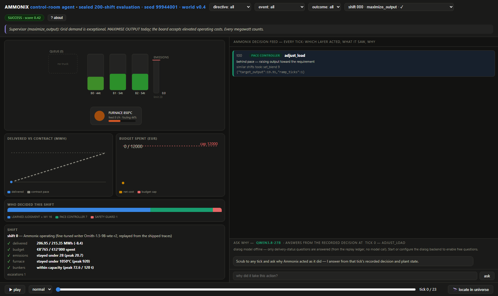

# Industrial Control-Room Agent

**A control-room operator for a waste-to-energy plant, built by harness engineering over a
fully synthetic plant world — every decision attributed to the layer that made it, with a
complete, replayable audit trail.** Source-available research software from Ammonix.



## What this is

The agent runs a simulated waste-to-energy plant one 24-tick shift at a time. It routes or
rejects incoming waste trucks, orders lab tests, sets the bunker blend, adjusts the furnace
load, buys cover or sells surplus, schedules boiler cleaning and escalates to a supervisor —
under a delivery contract, an emissions limit, a furnace temperature limit, bunker capacities
and a budget, with crew radio and supervisor directives arriving as free text. Every decision
is made by one of the agent's layers and logged as such: **learned judgment** (a calibrated
classifier swarm over 225,644 recorded plant states, with a 9B language-model *writer*
filling the action payload and a verifier checking it), the **pace controller**, the
predictive **safety guard**, the **landing controller**, or the **experience ladder** that
replays what a successful neighbouring shift did.

This repository is the agent's operator UI together with the sealed evaluation it replays:
the **shift theatre** (any of the 200 sealed shifts, tick by tick — plant schematic, decision
feed, the reasons, the per-constraint outcome), the **Knowledge Universe** 3-D explorer (the
recorded states in calibrated action-success space, with the shift's trajectory drawn into
it), the **operator dialog**, the deterministic plant engine the replay runs on, the trained
basis the learned-judgment layer scores with, and the sealed run's traces, checkpoint and
report. On the sealed cohort of 200 shifts the agent never trained on, the fine-tuned writer
lands **178 successes (89.0%) with 0 hard-safety violations**; the best rule-based teacher
persona lands 85.0% with 5 hard violations, and the oracle ceiling of the cohort is 98.5%.

## The Ammonix family
This repo accompanies *The Ammonix Industrial Control Room Agent: Learning to Operate
Industrial Plants from Logged Experience* (https://doi.org/10.5281/zenodo.22871228). Siblings:
[ammonix-rcm-agent](https://github.com/ammonix-ai/ammonix-rcm-agent) ·
[ammonix-ecg-agent](https://github.com/ammonix-ai/ammonix-ecg-agent)
— see the Foundation paper (https://doi.org/10.5281/zenodo.22859098).

## License
Released under the Ammonix Research License (`LICENSE.md`): research, educational, and
evaluation use is free — including evaluation by a commercial organization deciding whether
to seek a commercial license. Any commercial use requires a separate license from Ammonix —
contact licensing@ammonix.ai. Third-party notices: `NOTICE.md`.

## Quickstart

> Verified 2026-09-21 on a fresh clone in a clean venv (Python 3.13): tests green, all 200
> sealed shifts replay to their recorded outcomes — no key, no model, no download.

```bash
git clone https://github.com/ammonix-ai/ammonix-industrial-control-room-agent.git && cd ammonix-industrial-control-room-agent
python -m venv .venv && .venv/Scripts/activate    # Windows; use bin/activate on Unix
pip install -r requirements.txt
uvicorn ui.server:app --port 8080
# open http://localhost:8080 — replay mode is the default: browse the 200 sealed
# shifts, the decision feed behind every tick, and the per-constraint outcome.
```

The first start rebuilds the basis's neighbour index (about ten seconds; it is a 132 MB
matrix, above GitHub's file limit, and is rebuilt bit-identically from the shipped scaler
and features — `python scripts/build_nn_index.py --verify` does it explicitly and checks the
pinned hash). `python scripts/check_release.py` verifies every shipped artefact and replays
all 200 shifts; `python -m pytest tests -q` runs the release tests.

The chat widget needs a dialog model — see below.

## Demo / UI

Replay-first. A welcome overlay explains the plant, the five constraints a shift must
satisfy and the tick loop before the theatre opens. It appears on every visit until the
visitor ticks *don't show this again*; the *? about* button and `/?welcome=1` always show it, and `/?welcome=0` skips it for one load. Pick a shift (filter by directive, rare event, outcome),
scrub or play through its ticks: the schematic shows the queue, bunkers, furnace and emissions the agent saw at
that moment; the feed says which layer acted, what it recommended, what similar recorded
shifts did, and why; the outcome panel scores every success constraint on the true
trajectory. *Locate in universe* opens the shift's path in the 3-D explorer (`/universe/`).

The same interface is the deployed agent of the paper, with the model roles of the Ammonix
releases:

| Role | Model | On this server |
|---|---|---|
| **Writer** — the paperwork: the action payloads of the learned-judgment layer | the trained 9B, **Ornith-1.5-9B-wte-r2** (`runs/manifests/writer_pin.json`: base Ornith-1.5-9B + the r2 adapter, temperature 0, schema-constrained decoding) | replays from its shipped traces; the only model that operated the recorded shifts |
| **Explainer** — the operator dialog (the chat widget) | stock **Qwen3.8-27B** through any OpenAI-compatible endpoint (`runs/manifests/explainer_pin.json`) | live once configured; a hosted backend is disclosed in the widget |
| **Learned judgment** — scores, retrieved neighbours, universe panels | the shipped classifier swarm, calibrators and neighbour index | live, local, no model call |

The dialog answers *why* the agent acted as it did at the tick on screen. Its request carries
the recorded decision, the logged reasons, the neighbour support, the plant observation, the
bunker rankings and the delivery lifecycle from the replay ledger; plain delivery-status
questions ("was the truck accepted?") are answered from the ledger without a model call. To
enable free questions, point it at a Qwen endpoint:

```bash
export DEMO_DIALOG_BASE=https://<provider>/v1      # OpenAI-compatible chat completions
export DEMO_DIALOG_MODEL=<the provider's Qwen3.8-27B model id>
export DEMO_DIALOG_KEY=<api key>                    # sent as a bearer token
# optional: DEMO_DIALOG_EXTRA='{"reasoning": {"enabled": false}}' for gateways whose
# control fields differ; the local default base is http://127.0.0.1:8001/v1 (vLLM)
uvicorn ui.server:app --port 8080
```

`GET /ammonix/llm_health` reports `{available, remote, model}`; the page labels the chat from
it. Live answers from a hosted stock model are not the paper's pinned local model, and the
widget says so to the visitor. Nothing else in the demo depends on the dialog model.

## Reproducing the paper
See [REPRODUCING.md](REPRODUCING.md): which results this drop regenerates exactly (the sealed
replay, the crisis-benchmark table), which ship as audited reports, and what the full factory
adds.

## Status & limitations
Research software, released for auditability and reproduction of the paper — not a
supported product. The plant world is fully synthetic; its parameters are design constants
(the delivery band is calibrated conservatively against a public waste contract), so results
transfer to a real facility only in the ways the paper states. This drop is the operator UI
plus the sealed evaluation and the runtime pieces the UI needs (plant engine, trained basis,
learned-judgment scoring). The factory — world generation, the working corpus build, swarm
and writer training, the evaluation runners and the crisis benchmarks — is not part of it;
the reports of those runs ship under `runs/reports/` for audit. The writer's fine-tuned
weights are on Hugging Face as `Ammonix/AmmonixWtE-Writer-9B` (hashes pinned in `runs/manifests/writer_pin.json`);
the hosted dialog model is a stock Qwen, not the pinned local model that ran during the build.

## Disclaimer
Research software, no warranty — see `LICENSE.md`. The plant, suppliers, contracts, crew
messages and outcomes are synthetic; nothing here is operating advice for a real facility.

## Cite
See [CITATION.cff](CITATION.cff). Commercial contact: licensing@ammonix.ai.
